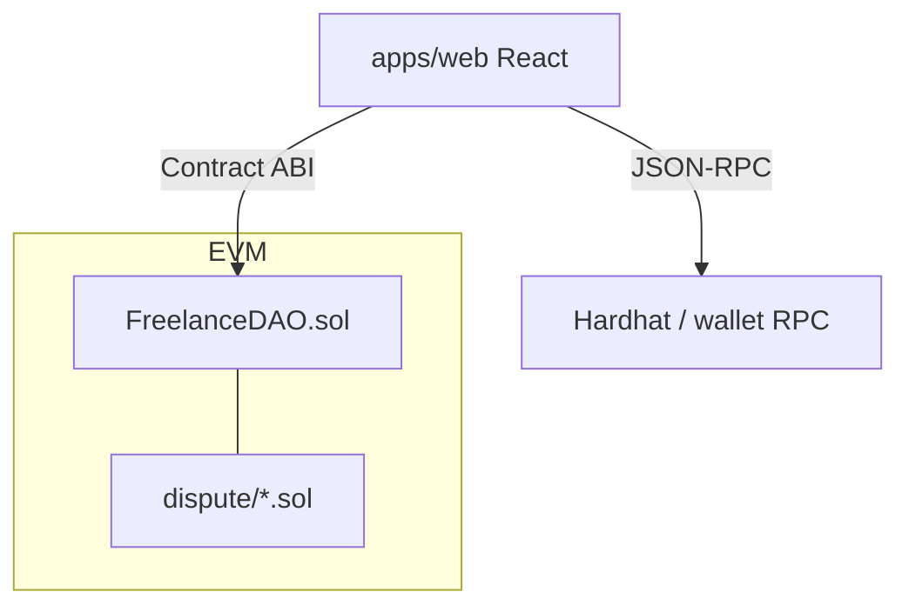

# Lancechain

On-chain escrow for freelance-style projects: Solidity 0.8.27 under Hardhat, plus a wallet-connected operator console (ethers v6). Funds sit in the contract until the client confirms completion.

## Protocol (FreelanceDAO)

| Function | Actor | Effect |
| --- | --- | --- |
| `createProject(freelancer)` | Client | `payable`; locks `msg.value` in project slot |
| `markAsCompleted(id)` | Freelancer | Sets completion flag |
| `confirmCompletion(id)` | Client | Releases escrow via `call{value}` |
| `raiseDispute` / `resolveDispute` | Parties | Dispute path (see `contracts/dispute/`) |

Payouts use low-level `call` with balance zeroing to avoid stale `transfer` semantics. Unit tests cover create, release, and authorization failures.

## Architecture



## Contracts workspace

```bash
cd services/contracts
npm install
npx hardhat compile    # compiles contracts/ + contracts/dispute/
npx hardhat test       # FreelanceDAO.js (3 cases)
npx hardhat node
# deploy
npx hardhat run scripts/deploy.js --network localhost
```

Solidity layout:

- `contracts/FreelanceDAO.sol` - escrow state machine
- `contracts/dispute/` - `DisputeResolution`, `VotingMechanism`, `ReputationTracker`

## Web console

```bash
cd apps/web
cp .env.example .env
npm install
npm start
```

Set `REACT_APP_FREELANCE_DAO_ADDRESS` from deploy output. Console supports connect wallet, fund project, mark complete, read chain state, release escrow.

Production build: `npm run build` (CI job on `main`).

## Engineering notes

- **Packages:** `@lancechain/contracts` (Hardhat), `@lancechain/web` (CRA + ethers)
- **CI:** Hardhat compile + test; web production build
- **Local chain:** default RPC `http://127.0.0.1:8545`, chain id `31337` in `.env.example`

## License

MIT
