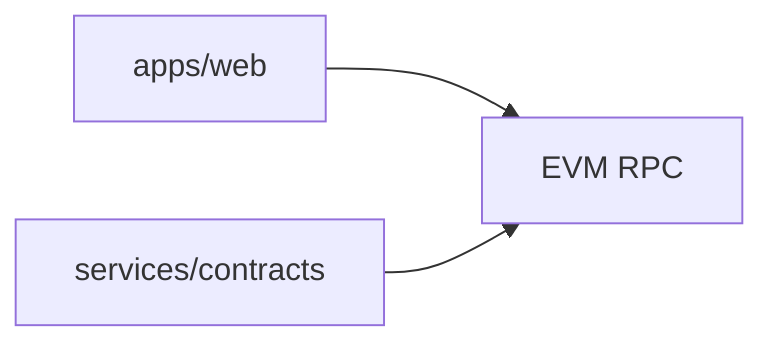

# FreelanceDAO (archive)

Snapshot of the FreelanceDAO stack before later refactors. Same split as the
active project:

- `apps/web/` - React client and MetaMask integration
- `services/contracts/` - Hardhat project, Solidity sources, deployment scripts

See the main [freelanceDAO](https://github.com/Aneesh495/freelanceDAO) repository
for the maintained README and feature list. This tree is kept for contract and UI
history.

## Architecture

## License

MIT
