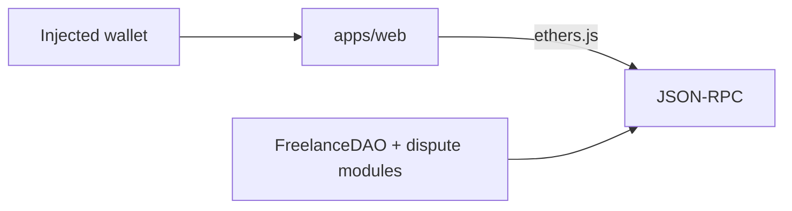

# Lancechain

On-chain escrow for freelance work: Hardhat contracts under `services/contracts`,
wallet console under `apps/web`.

## Architecture



## Contracts

```bash
cd services/contracts
npm install
npx hardhat compile
npx hardhat test
npx hardhat node
# separate terminal
npx hardhat run scripts/deploy.js --network localhost
```

Set the printed address in `apps/web/.env` as `REACT_APP_FREELANCE_DAO_ADDRESS`.

## Web console

```bash
cd apps/web
cp .env.example .env
npm install
npm start
```

Minimal flows: connect wallet, create funded project, mark complete, release escrow.

## Layout

| Path | Role |
| --- | --- |
| `services/contracts/contracts/` | Protocol sources |
| `services/contracts/test/` | Hardhat tests |
| `apps/web/` | Operator console |

## License

MIT
