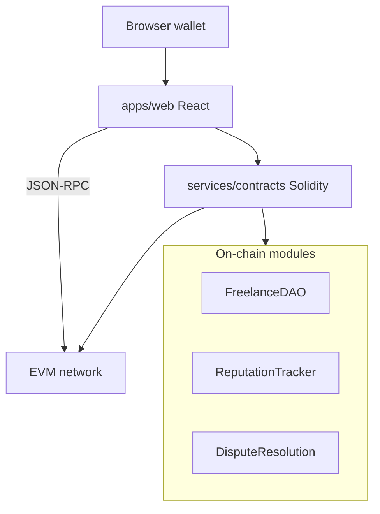

# Lancechain

Ethereum freelance marketplace: Hardhat smart contracts and a React wallet UI.
Escrow-style payments, reputation tracking, and dispute voting live under
`services/contracts/`; the dapp shell is in `apps/web/`.

## Architecture



## Setup

```bash
cd services/contracts && npm install
npx hardhat compile && npx hardhat test

cd ../../apps/web && npm install && npm start
```

Deploy with Hardhat, then update contract addresses in the web client config.

## Layout

| Path | Role |
| --- | --- |
| `services/contracts/contracts/` | Core protocol contracts |
| `services/contracts/DisputeVoting/` | Voting and reputation helpers |
| `apps/web/` | Project flows and MetaMask integration |

## License

MIT
